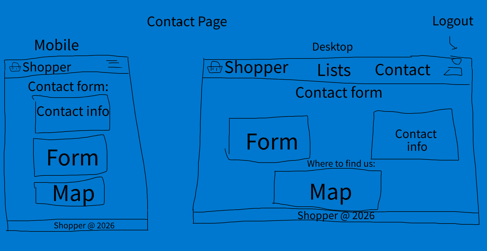
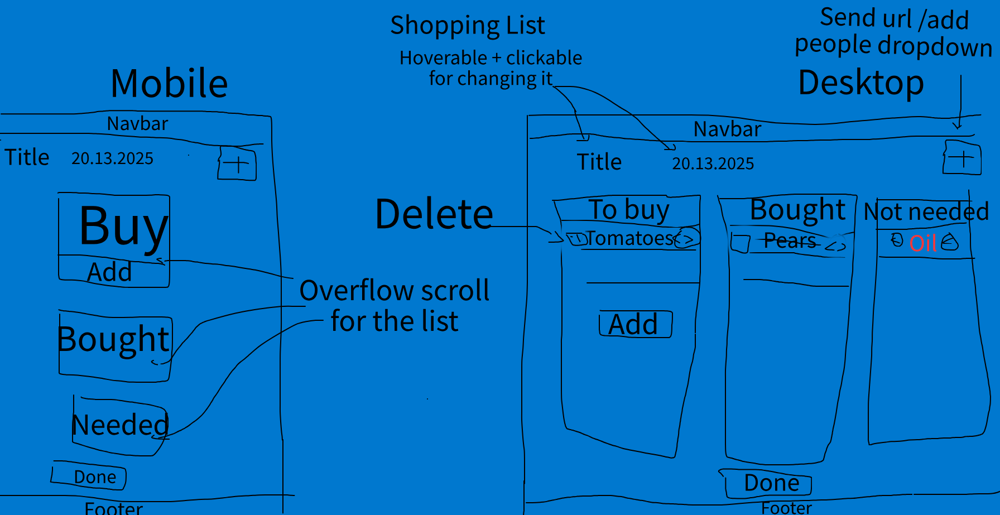
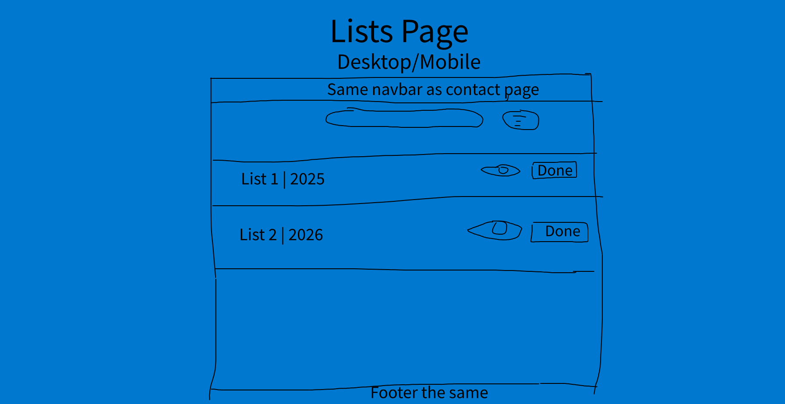

# Shopper - Rares Stefea

## UI - Desktop + Mobile

## Wireframes

- Contact Page wireframe:
  

- Landing Page wireframe:
  

- Shopping List Open wireframe:
  
- List of lists wireframe:
  

## Kanban board

The Trello Kanban board, containing the tasks and process of development is [accesible here](https://trello.com/invite/b/699c19de6704f110ffa9fd57/ATTIfc180dd53229cfc5d9a228c0f4686bab717500DB/shopper-react-app).

## Features

- **Synchronization**: Via Supabase to ensure shopping lists are updated instantly across all devices.
- **List Management**: Full CRUD capabilities allowing you to create, update, and delete multiple shopping lists.
- **Item Control**: Manage individual items within lists, including price tracking and status of the ote,.
- **Secure Authentication**: User sessions with custom authentication modals and protected routing.
- **Dark Mode**: A dark mode that syncs with your local storage and persists based on your preference.
- **Responsive**: Fluid design for both desktop browsers and mobile devices.

## Architecture

The application follows a modular, state based architecture and predictable data flow:

- **State Management**: Centralized Redux store managing four primary slices:
  - `ui`: Controls modal visibility and dark mode state.
  - `auth`: Manages user authentication status and credentials.
  - `lists`: Handles the collection of all user owned shopping lists.
  - `activeList`: Manages the specific list currently in view, utilizing `createAsyncThunk` for API interaction and error handling.
- **API Layer**: Isolated Supabase logic for clean separation of concerns.
- **Styling**: Modern CSS with utility variables for consistent theming and accessibility.

## Tech Stack

- **Core**: React 19, Vite 6
- **Backend**: Supabase (PostgreSQL + Auth)
- **State**: Redux Toolkit, React-Redux
- **Routing**: React Router 7

**This project uses [Madge](https://www.npmjs.com/package/madge) for circular dependency checking:**

```bash
npx madge --circular --extensions js,jsx src/
```

## Setup

To install and run the project locally:

1.  **Clone**:

    ```bash
    git clone <this-url>
    cd shopper
    ```

2.  **Install dependencies**:

    ```bash
    npm install
    ```

3.  **Configure Supabase**:
    Create a `.env.local` file in the root directory and add your Supabase credentials:

    ```env
    VITE_SUPABASE_URL=your_supabase_url
    VITE_SUPABASE_ANON_KEY=your_supabase_anon_key
    ```

4.  **Launch Dev Server**:

    ```bash
    npm run dev
    ```

5.  **Build for Production**:
    ```bash
    npm run build
    ```
